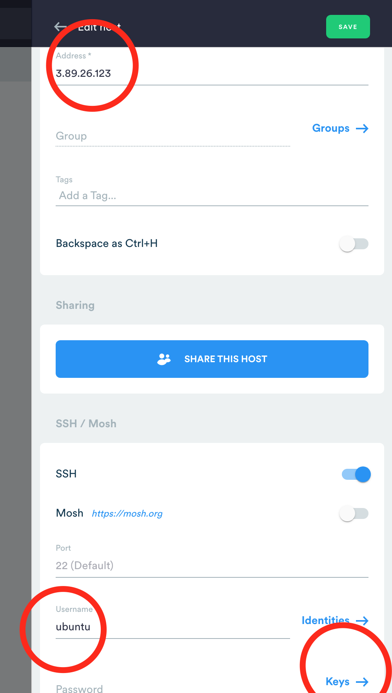
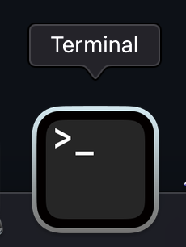

# Pasos para tener su LAMP server en Ubuntu 20 dentro de AWSEducate

- Acceder a su beca de AWSEducate.com de $50 dolares y via CONSOLA invocar EC2 
- EC2: Plan básico de Ubuntu 20 “FREE TIER” (libre de cobro)
- EC2: Seleccionar todo por DEFAULT
- EC2: SECURITY GROUPS habilitar "HTTP, HTTPS y SSH" de la lista de firewall de AWS apuntando a 0.0.0.0 (todo el mundo accesa)
- EC2: Anotar la direccion IP para acceder en el siguiente paso.
- EC2: Teclear "llave" de acceso con un nombre de archivo fácil de recordar (ejemplo: llavesita.pem)
- Descargar: TERMIUS.com o Git For Windows https://git-scm.com/download/win para WINDOWS
- Descargar: en macOS y Linux es opcional pero puede usar TERMIUS.com si lo prefiere, para Android e Iphone es bienvenido instalarlo.
- VIDEO PARTE 1:https://youtu.be/YwmyVAnQ0RI

----

## Dos vias para acceder via SSH al nuevo servidor via TERMIUS

- Agregar la llavesita.pem al KEYCHAIN (o llavero) de la APP en Android/iphone solo copiar el TEXTO en area PrivateKEY
- Video para Iphone: https://youtu.be/71hE_9ke6k4 en Android muy similar, copiando texto de la llave.
- Agregar HOST (Direccion-ip-de-AWS)
- Agregar IP Direccion-ip-de-AWS
- Anotar el usuario es "ubuntu" minusculas sin contraseña
- KEY es la *llavesita.pem* que esta descargas en su PC al crear AWS EC2 instancia
- Y conectarse, puede aumentar el tipo de letra si esta muy chica en PREFERENCIAS y reconectarse.
NOTA: poner bien la direccion IP no agregar espacios déspues o antes, TERMIUS marca error.


## Acceder con GIT-FOR-WINDOWS, macOS y Linux
Son estos tres comandos para acceder en los otros sistemas operativos, la diferencia en Windows abrir el POWERSHELL o CMD dentro de menu de ejecución y en los otros dos usar la TERMINAL.

```
$ cd descargar (el directorio donde esta la llavesita.pem)
$ chmod 400 llavesita.pem
$ ssh -i llavesita.pem ubuntu@Direccion-ip-de-AWS
```

## CHROMEBOOKS agregar la extensión de SSH en complementos
----

# INCIAR INSTALACION L.A.M.P. (Linux, Apache, Mysql, Php)
Una vez que esta dentro SSH del servidor aplicar las instrucciones de instalación siguiente:
```
sudo su
apt-get -y install wget git
git clone https://github.com/teddysun/lamp.git
cd lamp
chmod 755 *.sh
./lamp.sh
```
Y esperar 25 minutos promedio, por tal ocuparemos crear nuestro DOMINIO GRATUITO en NAME.COM con la beca de GitHub Pro
VIDEO PARTE 2: https://youtu.be/4qD030SzmH8 
donde se tramita en https://www.name.com/partner/github-students
```
DIRECCION POSTAL DE LA PREPARATORIA:
Paseo de los Heroes 11161,
Zona Rio
Tijuana BC
CP 22010
Telf 664 686 2701
```
---

# ASIGNACION DE LA DIRECCION-IP de AWS A EL NUEVO DOMINIO BECA
Una vez que esté utilizando servidores de nombres, siga los pasos a continuación:
- Inicie sesión en su cuenta de Name.com.
- Haga clic en el botón MIS DOMINIOS, ubicado en la esquina superior derecha.
- Haga clic en el nombre de dominio para el que desea crear un registro A.
- Haga clic en Administrar registros DNS.
Aquí agregará el registro A deseado, proporcionado por su anfitrión. Normalmente, crearía 2 registros: un registro simple y para subdominios (incluido www):
**Primer registro A: **
- Deje el menú desplegable Escriba como A
- Deje el campo Host en blanco

- Ingrese o copie y pegue la dirección IP en el campo Respuesta.
- Deje TTL en 300 (predeterminado)
- Haga clic en el botón azul Agregar registro.


